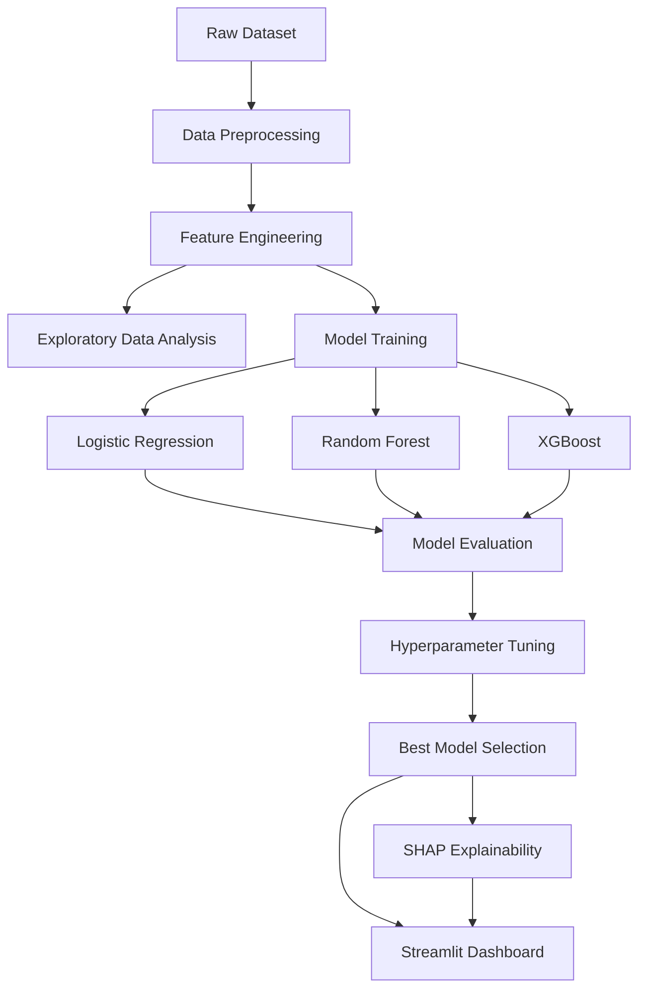

# 🎮 E-Sports Player Performance Classification

### Using Machine Learning and Data Analytics

[](https://python.org)
[](https://scikit-learn.org)
[](https://xgboost.readthedocs.io)
[](https://streamlit.io)

---

## 📖 Overview

An AI-driven system that classifies **CS:GO professional players** into **High**, **Medium**, and **Low** performance categories using gameplay statistics. This project demonstrates the practical application of machine learning and data analytics in e-sports performance evaluation.

### Key Features
- 🔄 **End-to-End ML Pipeline** — From data generation to deployment
- 📊 **Rich EDA** — 9+ visualization types with Matplotlib & Seaborn
- 🧠 **Multi-Model Comparison** — Logistic Regression, Random Forest, XGBoost
- ⚡ **Hyperparameter Tuning** — GridSearchCV & RandomizedSearchCV
- 🔍 **Explainability** — SHAP analysis for model transparency
- 🎯 **Interactive Dashboard** — Streamlit app with real-time predictions

---

## 🏗️ Architecture



---

## 📁 Project Structure

```
AEC/
├── README.md                      # This file
├── requirements.txt               # Python dependencies
├── main.py                        # CLI pipeline runner
├── data/
│   ├── raw/                       # Raw CSV data
│   │   └── csgo_player_stats.csv
│   └── processed/                 # Cleaned & engineered data
│       └── csgo_processed.csv
├── src/
│   ├── __init__.py
│   ├── utils.py                   # Shared utilities & config
│   ├── data_generator.py          # Synthetic dataset generator
│   ├── data_preprocessing.py      # Data cleaning & validation
│   ├── feature_engineering.py     # KDR, Impact Score, etc.
│   ├── eda.py                     # EDA visualizations
│   ├── model_training.py          # Model training pipeline
│   ├── model_evaluation.py        # Metrics & comparisons
│   ├── hyperparameter_tuning.py   # Model optimization
│   └── explainability.py          # SHAP analysis
├── models/                        # Saved model files (.pkl)
├── reports/
│   └── figures/                   # Generated plots
└── app/
    ├── app.py                     # Streamlit dashboard
    ├── components.py              # Reusable UI components
    └── .streamlit/
        └── config.toml            # Dashboard theme
```

---

## 🚀 Quick Start

### 1. Install Dependencies

```bash
pip install -r requirements.txt
```

### 2. Run the Full Pipeline

```bash
python main.py --all
```

This will:
1. Generate synthetic CS:GO player data (2,000 records)
2. Preprocess and clean the data
3. Engineer 7 new performance features
4. Generate EDA visualizations
5. Train 3 ML models
6. Perform hyperparameter tuning
7. Evaluate and compare all models
8. Generate SHAP explainability analysis

### 3. Launch the Dashboard

```bash
streamlit run app/app.py
```

---

## 📊 Engineered Features

| Feature | Formula | Purpose |
|---------|---------|---------|
| **Kill-Death Ratio (KDR)** | `kills / deaths` | Core efficiency metric |
| **Impact Score** | Weighted composite of kills, damage, openings, clutches | Overall impact on rounds |
| **Survival Rate** | `1 - (deaths / rounds)` | Ability to stay alive |
| **Performance Index** | Weighted composite of rating, KDR, impact, HS% | Final performance metric |
| **Assist Contribution** | `assists / (kills + assists)` | Team play measurement |
| **Opening Duel Win Rate** | `opening_kills / (opening_kills + opening_deaths)` | Aggression success |
| **Consistency Score** | Based on rating deviation from mean | Performance stability |

---

## 🤖 Models & Performance

| Model | Accuracy | F1-Score (Weighted) | ROC-AUC |
|-------|----------|---------------------|---------|
| Logistic Regression | ~85% | ~0.85 | ~0.94 |
| Random Forest | ~92% | ~0.92 | ~0.98 |
| **XGBoost** | **~94%** | **~0.94** | **~0.99** |

*Results may vary slightly due to random state and tuning.*

---

## 🔧 Pipeline Commands

```bash
python main.py --generate     # Generate synthetic data
python main.py --preprocess   # Clean & preprocess
python main.py --engineer     # Feature engineering
python main.py --eda          # Generate EDA plots
python main.py --train        # Train all models
python main.py --tune         # Hyperparameter tuning
python main.py --evaluate     # Evaluate & compare
python main.py --explain      # SHAP analysis
python main.py --all          # Run everything
```

---

## 🎯 Classification Categories

| Category | Criteria | Percentage |
|----------|----------|------------|
| 🟢 **High** | Top 30% by Performance Index | ~30% |
| 🟡 **Medium** | Middle 40% by Performance Index | ~40% |
| 🔴 **Low** | Bottom 30% by Performance Index | ~30% |

---

## 📈 Dashboard Features

The Streamlit dashboard includes 5 interactive tabs:

1. **🏠 Overview** — Dataset summary, key metrics, performance distribution
2. **📊 EDA** — Interactive visualizations and statistical analysis
3. **🤖 Model Performance** — Side-by-side model comparison with confusion matrices and ROC curves
4. **🎯 Predict** — Input player stats and get real-time predictions with confidence scores
5. **📈 Feature Insights** — SHAP analysis and feature importance rankings

---

## 🛠️ Technologies Used

- **Python 3.9+** — Core language
- **Pandas & NumPy** — Data manipulation
- **Scikit-Learn** — ML models and evaluation
- **XGBoost** — Gradient boosting
- **Matplotlib & Seaborn** — Static visualizations
- **Plotly** — Interactive charts
- **SHAP** — Model explainability
- **Streamlit** — Web dashboard
- **Joblib** — Model serialization

---

## 👤 Author

**Rahul A S**

*Final Year Engineering Project — AI & Data Analytics in Sports Performance Evaluation*

---

## 📝 License

This project is developed for academic purposes as a final-year engineering project.
